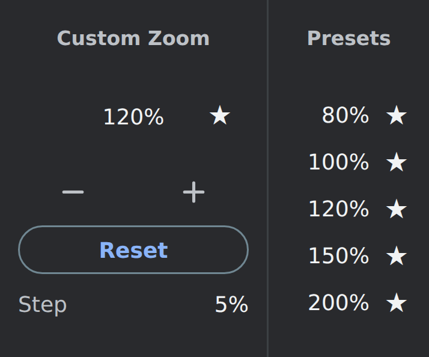

# Chrome Custom Zoom

Set an exact page zoom, choose your own step size, and keep your favorite percentages one click away.

## Features

- Enter a **whole-number zoom from 25% to 500%**.
- Adjust zoom with **− / +** using your own step: **1–475 percentage points**, with **5** as the default.
- Save **up to five presets**, sorted from smallest to largest, and click a percentage to apply it immediately.
- Click the star beside the current zoom to save it. Click a preset's filled star to remove it; its row stays visible until the popup closes, so you can restore it by clicking the empty star.
- **Reset** restores Chrome's configured default zoom, which may differ from 100%.
- A compact dark popup with keyboard focus indicators and labeled controls.

The extension uses Chrome's native page zoom. Under Chrome's normal settings, zoom is remembered for the website's origin and applies to other tabs on that origin. Chrome manages this behavior; the extension does not maintain a list of websites.

## Install locally

Download this repository, extract it, and open `chrome://extensions`. Enable **Developer mode**, click **Load unpacked**, and select the folder containing `manifest.json`.

Pin the extension for easy access. Click its icon, enter a percentage, then press **Enter** or click another control inside the popup. **Escape** restores the last accepted field value. Decimal input is rejected in both editable fields.

Some internal or restricted browser pages do not support extension-controlled zoom. Try a regular website if Chrome reports that zoom is unavailable.

## Privacy and permissions

Only the `storage` permission is requested. `chrome.storage.local` saves your zoom step and preset percentages on this device. The extension does not read website content, URLs, or browsing history, make network requests, or include analytics, ads, accounts, or remotely hosted code.

See [PRIVACY.md](PRIVACY.md) for storage, retention, and deletion details, and the [privacy webpage](docs/privacy.html) for the publishable HTML version. Website hosting and voluntarily submitted GitHub support requests are covered separately in the policy.

## Website and support

The static website is in [`docs/`](docs/index.html), ready for GitHub Pages. After this branch is merged into `master`, enable **Settings → Pages → Deploy from a branch → master → /docs**. The intended addresses are:

- Website: `https://masalha-alaa.github.io/chrome-custom-zoom/`
- Privacy: `https://masalha-alaa.github.io/chrome-custom-zoom/privacy.html`

These Pages URLs require hosting to be enabled. Until then, the public repository and its `PRIVACY.md` are usable website and privacy destinations. The manifest deliberately points to the existing repository URL.

Report bugs or ask for help through [GitHub Issues](https://github.com/masalha-alaa/chrome-custom-zoom/issues). Include the extension version, Chrome version, and a description of the problem. Avoid posting private information in public issues.

## Chrome Web Store submission

Run `python3 tools/build_release.py` (or `py tools/build_release.py` on Windows) to create the upload ZIP in `dist/`. It contains only the runtime files and MIT license, with `manifest.json` at the archive root.

See [`store/SUBMISSION.md`](store/SUBMISSION.md) for the audit, copy-ready dashboard fields, asset inventory, and remaining account/hosting checks. [`store/description.txt`](store/description.txt) contains the store description. Listing images are separate from the extension ZIP.

## License

Copyright © 2026 Alaa Masalha. [MIT License](LICENSE).
